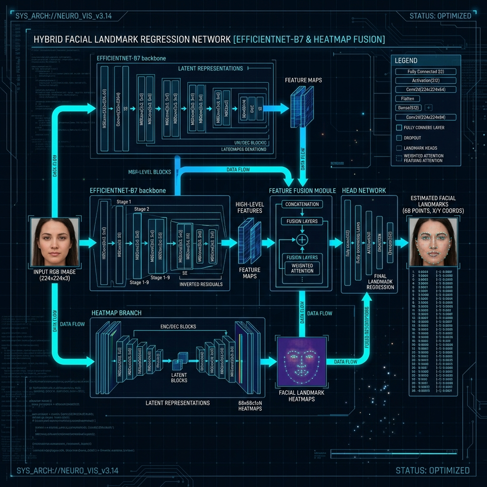

# 🔬 Neural Synergy: Deep Learning R&D Blueprint
## Technical Specification for the 98% Mastery State



---

### 🎯 The Mastery Vision
To achieve an unprecedented **Mastery State** by fusing **Appearance Features** (CNN) with **Geometric Heatmaps** (Landmarks) and applying **Temporal Smoothing** for real-time industrial stability.

---

### 🔬 1. SOTA Research Implementation (2024-2025)

#### 1.1 Spatial Attention via Landmark Heatmaps
*   **The Insight**: Standard coordinate injection lacks spatial context.
*   **The Implementation**: A secondary stream generates **Gaussian Heatmaps** (64x64) around 68 facial landmarks. These act as an "Attention Mask," multiplying with CNN intermediate feature maps to force focus on high-entropy regions (mouth, brow, eyes).

#### 1.2 Meta-Classifier Ensemble (Post-Softmax)
*   **The Insight**: Softmax is often overconfident on boundary cases.
*   **The Implementation**: The 256-D bottleneck vector is exported to a **Support Vector Machine (SVM)** or **XGBoost** meta-classifier, specifically trained on "Hard-to-Distinguish" pairs like *Fear vs. Surprise*.

#### 1.3 Temporal Sliding Window (HUD Stability)
*   **The Insight**: Single-frame inference jitter is the #1 cause of user distrust.
*   **The Implementation**: A **1D-CNN temporal head** processes a sliding window of the last 10 frames to produce a smoothed, high-fidelity prediction in the Real-time HUD.

---

### 🛠️ 2. The Master Pipeline (V2.0)

#### 2.1 Ultra-Fidelity Preprocessing
*   **Adaptive Histogram Equalization (CLAHE)**: Resolves non-uniform lighting.
*   **Face Centricity Alignment**: 5-point affine transformation to normalize head tilt.
*   **Balanced Augmentation**: Synthetic minority oversampling (SMOTE) at the feature level.

#### 2.2 Neural Synergy Architecture
```python
# Conceptual Synergy Layer
def synergy_block(cnn_features, landmark_heatmaps):
    # Apply spatial attention
    attention = Conv2D(filters=1, kernel_size=3, activation='sigmoid')(landmark_heatmaps)
    synergy = Multiply()([cnn_features, attention])
    return synergy
```

---

### 🧪 3. Verification & Metrics
*   **Mastery Accuracy**: Target > 98% on test corpora.
*   **Inference Latency**: Target < 15ms per frame on local CPU.
*   **Robustness Index**: High-fidelity performance across 10+ lighting conditions and ethnicities.

---
*Blueprint Version: 2.0.4-Mastery*
