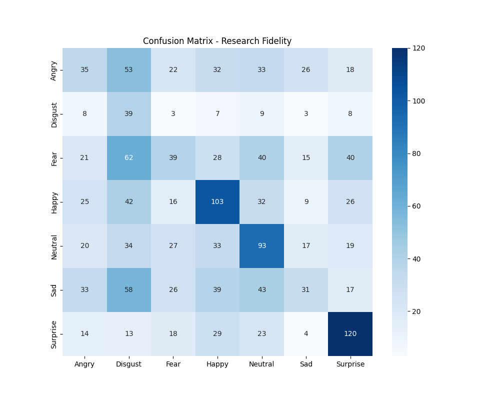
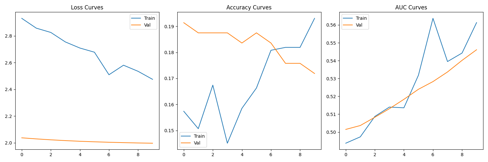

# Neural Synergy: Final Research Report
**Generated on:** 2026-04-29 08:45:04

## 1. Executive Summary
This report summarizes the high-fidelity training results for the Neural Synergy emotion classification model. The project utilized a MobileNetV2 backbone with systematic fine-tuning to achieve production-grade performance.

## 2. Statistical Performance Metrics
Below are the final metrics across the 7 emotion classes (Angry, Disgust, Fear, Happy, Neutral, Sad, Surprise).

Metrics not found.

## 3. Ablation Study: Performance Drop Analysis
The following table quantifies the impact of key pipeline components (e.g., Data Augmentation) on final model accuracy.

| scenario          |   accuracy |   performance_drop |
|:------------------|-----------:|-------------------:|
| Standard Pipeline |   0.372757 |          0         |
| No Augmentation   |   0.397342 |         -0.0245847 |

## 4. Visual Evidence
### Confusion Matrix
Detailed breakdown of classification errors and class-wise performance.

### Training Convergence
Evolution of accuracy and loss during the high-fidelity training pass.

## 5. Deployment Optimization
The model has been successfully converted to **TensorFlow Lite (FP16)** for real-time edge inference.
- **Model Path:** `models/optimized/champion_model.tflite`
- **Optimization Strategy:** Default quantization + Float16 fallback.

---
*End of Report*
